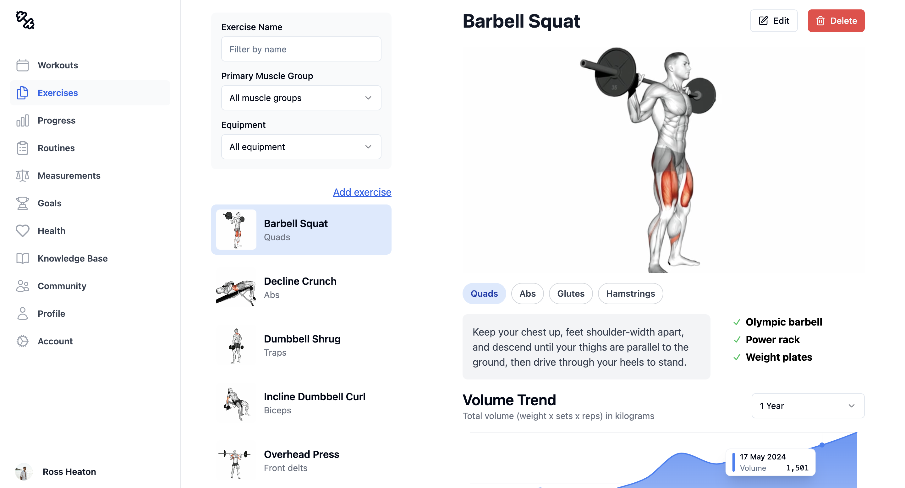

# Gym



I built this app because I want to track my workouts and visualise my progress without handing away my data to a third party.

## Features

- Visualise workout progress over time
- Log workouts with detailed information
- Track performance statistics for each exercise
- Create and manage custom exercises
- Categorise exercises by muscle groups and equipment
- Authentication using Clerk
- Persist data in your own PostgreSQL database
- Fully mobile responsive

## Development Instructions

### Prerequisites

- Go (latest version)
- Node.js and npm
- Docker and Docker Compose

### Setup

1. Clone the repository:

   ```
   git clone https://github.com/rossheat/gym.git
   cd gym
   ```

2. Set up environment variables:

   - Copy `.env.template` to `.env.development` in both `client` and `server` directories
   - Fill in the required values in both `.env.development` files

3. Start the PostgreSQL database using Docker Compose:

   ```
   docker-compose up -d
   ```

4. Install backend dependencies and run migrations:

   ```
   cd server
   go mod tidy
   go run . -env development
   ```

5. Install frontend dependencies:
   ```
   cd ../client
   npm install
   ```

### Running the Application

1. Start the backend server:

   ```
   cd server
   go run . -env development
   ```

2. In a new terminal, start the frontend development server:

   ```
   cd client
   npm run dev
   ```

3. Access the application at `http://localhost:5173`

Note: The backend server must be started before the frontend, as the frontend's dev script checks for backend availability.
